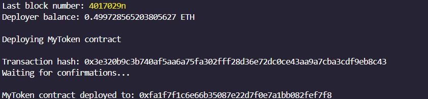

# Deploying a Token Contract on Lisk using Hardhat

This is a beginner tutorial meant to help guide developers on building on the Lisk Blockchain.

---

#### By [Anthony Kimani](https://github.com/anthonykimani)

---

#### Table of contents

- [Description](#description)
- [Requirements](#requirements)
- [Development](#development)
- [Testing](#testing)

---

### Description

`MyToken.sol` is a simple Token Contract where users can mint tokens, grantMinterRoles.

---

### Requirements

- Hardhat Runtime Environment for smart contract development. - `npm install --save-dev hardhat`
- Chai Testing Library - `$ npm install chai`

---

### Development

- In your Terminal, create a new directory with `mkdir <project-name>` and open the folder in your preferred code editor.

- Initialize a NodeJS project using the command `npm init -y`

- create a boilerplate hardhat project with `npx hardhat init`. For this project I'm using typescript and viem configurations

- Once you have your hardhat project create a `MyToken.sol` file, adding the following:

```typescript
// SPDX-License-Identifier: MIT
pragma solidity >=0.7.0 <0.9.0;

import {ERC20} from "@openzeppelin/contracts/token/ERC20/ERC20.sol";
import {AccessControl} from "@openzeppelin/contracts/access/AccessControl.sol";
import {ERC20Burnable} from "@openzeppelin/contracts/token/ERC20/extensions/ERC20Burnable.sol";
import {ERC20Votes} from "@openzeppelin/contracts/token/ERC20/extensions/ERC20Votes.sol";
import {ERC20Permit, Nonces} from "@openzeppelin/contracts/token/ERC20/extensions/ERC20Permit.sol";

contract MyToken is
    ERC20,
    AccessControl,
    ERC20Burnable,
    ERC20Permit,
    ERC20Votes
{
    bytes32 public constant MINTER_ROLE = keccak256("MINTER_ROLE");

    constructor() ERC20("MyToken", "MTK") ERC20Permit("MyToken") {
        _mint(msg.sender, 10 * 10 ** decimals());
        _grantRole(MINTER_ROLE, msg.sender);
    }

    function mint(address to, uint256 amount) public onlyRole(MINTER_ROLE) {
        _mint(to, amount);
    }

    function grantMinterRole(
        bytes32 _role,
        address _account
    ) public onlyRole(MINTER_ROLE) {
        _grantRole(_role, _account);
    }

    function getTokenBalanceAtBlock(
        address account,
        uint256 targetBlockNumber
    ) public view returns (uint256) {
        return getPastVotes(account, targetBlockNumber);
    }

    // The following functions are overrides required by Solidity.

    function _update(
        address from,
        address to,
        uint256 value
    ) internal override(ERC20, ERC20Votes) {
        super._update(from, to, value);
    }

    function nonces(
        address owner
    ) public view override(ERC20Permit, Nonces) returns (uint256) {
        return super.nonces(owner);
    }
}

```

- we used smart contracts from [openzepplin](https://docs.openzeppelin.com/contracts/5.x/) which you can install through `npm install @openzeppelin/contracts`

- now we should test the contract to verify the expected outputs, you can jump over to the [Testing Section](#testing)

- To deploy the contract we still need to :

1.  Install dependencies such as dotenv - `npm i dotenv`
2.  Configure our `.env` file with our [Alchemy API Key](https://www.alchemy.com/) and [Metamask private key](https://support.metamask.io/hc/en-us/articles/360015489531-Getting-started-with-MetaMask) . check out `.env.example`

- After configuring that we can create our `DeployMyToken.ts` in our `scripts` folder, with the following

```typescript
import { formatEther } from "viem";
import { abi, bytecode } from "../artifacts/contracts/MyToken.sol/MyToken.json";
import { createClients } from "./helpers";

async function main() {
  const { deployer, publicClient } = createClients();

  // print the last block number
  const blockNumber = await publicClient.getBlockNumber();
  console.log("Last block number:", blockNumber);

  // print the deployer balance
  const balance = await publicClient.getBalance({
    address: deployer.account.address,
  });
  console.log(
    "Deployer balance:",
    formatEther(balance),
    deployer.chain.nativeCurrency.symbol
  );

  //  use viem's deploycontract function to deploy
  console.log("\nDeploying MyToken contract");
  const hash = await deployer.deployContract({
    abi: abi,
    bytecode: bytecode as `0x${string}`,
  });

  // Get Contract Hash
  console.log("\nTransaction hash:", hash);
  console.log("Waiting for confirmations...");

  // Get Contract Address
  const txReceipt = await publicClient.waitForTransactionReceipt({ hash });
  console.log("\nMyToken contract deployed to:", txReceipt.contractAddress);
}

main().catch((error) => {
  console.error(error);
  process.exitCode = 1;
});

```

- To deploy the contract we can run `npx hardhat run scripts/DeployMyToken.ts`. You will get an output like:



- We can view the deployed contract [here](https://sepolia-blockscout.lisk.com/address/0xFa1F7F1c6e66B35087E22D7F0e7A1bB082FEf7f8) using the [Lisk Sepolia Testnet Explorer](https://sepolia-blockscout.lisk.com/) 

---

### Testing

- In the tests folder create a `MyToken.test.ts` file and add the following:

```typescript
import { expect } from "chai";
import { viem } from "hardhat";
import { loadFixture } from "@nomicfoundation/hardhat-network-helpers";
import { toHex, hexToString, fromHex, parseEther } from "viem";

async function fixture() {
  const publicClient = await viem.getPublicClient();
  const [deployer, account1, account2] = await viem.getWalletClients();
  const myTokenContract = await viem.deployContract("MyToken", []);
  return {
    publicClient,
    deployer,
    account1,
    account2,
    myTokenContract,
  };
}

const expectedDeployerTokenAmount = 10000000000000000000n;

describe("MyToken Contract", async () => {
  describe("When the MyToken Contract is Deployed", async () => {
    it("defines a contract with the MyToken name", async () => {
      const { myTokenContract } = await loadFixture(fixture);
      const tokenName = await myTokenContract.read.name();
      expect(tokenName).to.be.equal("MyToken");
    });
    it("gets the correct balanceOf Deployer", async () => {
      const { myTokenContract, deployer } = await loadFixture(fixture);
      const deployerBalance = await myTokenContract.read.balanceOf([
        deployer.account.address,
      ]);
      expect(deployerBalance).to.be.equal(expectedDeployerTokenAmount);
    });
  });
});
```

- Install Chai testing library using `npm i chai`. To test the contract we can run `npx hardhat test`
